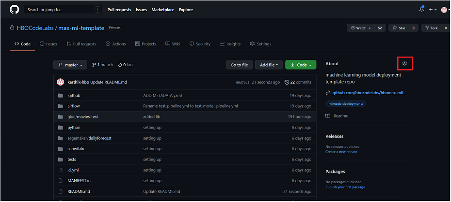
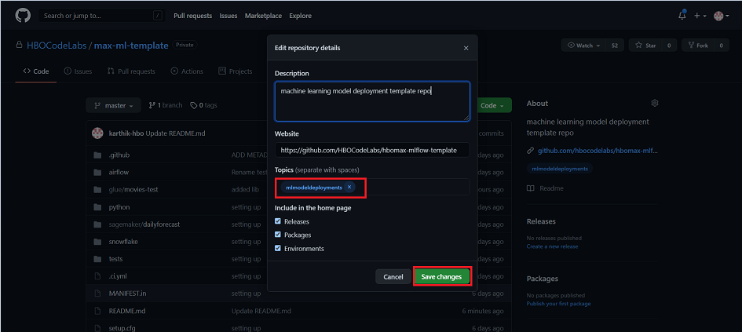
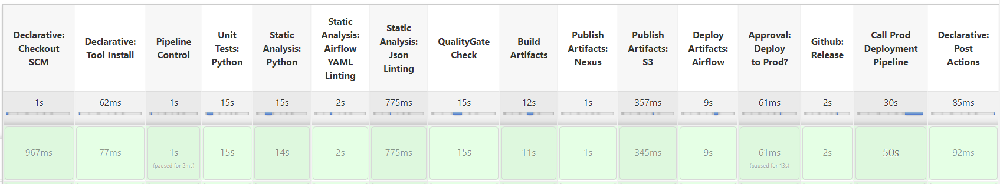
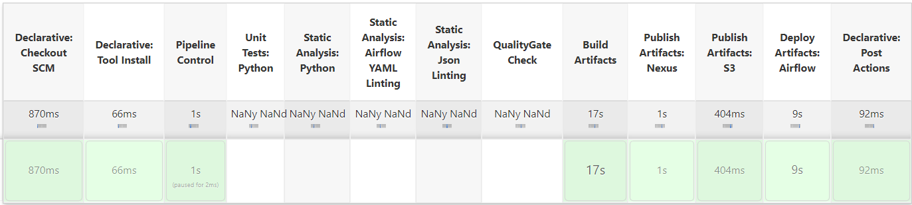
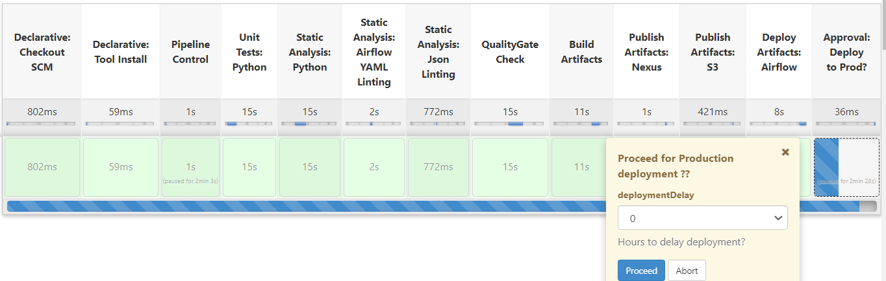

# max-ml-cookiecutter

Repository for [cookiecutter](https://cookiecutter.readthedocs.io/en/1.7.2/README.html)  max-ml mono repo template.

## Installation

Install the customized cookiecutter python package using the below command in your local development environment.

    pip install cookiecutter

## Generate a max-ml project structure

    cookiecutter --no-input git@github.com:HBOCodeLabs/max-ml-cookiecutter.git email=bdirisal@hbo.com project_name=max-ml-dailyforecast

## Usage

<b>Step 1:</b> Create a repo for your project and clone the repo into your development environment.<br>
<b>Step 2:</b> Create a new feature branch from your ```master``` branch. <br>
<b>Step 3:</b> Run the cookiecutter command to create your max-ml repo structure .<br>

```
[jenkins@ip-10-44-23-50 max-ml-dailyforecast]$ cookiecutter --no-input git@github.com:HBOCodeLabs/max-ml-cookiecutter.git email=karthikraj.kanagaraj@wmcontractor.com project_name=max-ml-dailyforecast

```
<br>
<b>Step 4:</b> If databricks support is required, add databricks_profile=profile_name to the cookicutter command.

    cookiecutter --no-input git@github.com:HBOCodeLabs/max-ml-cookiecutter.git email=karthikraj.kanagaraj@wmcontractor.com project_name=max-ml-dailyforecast databricks_profile=sensitive

Allowed values of databricks_profile: ```general, sensitive, restricted, subscription-restricted``` <br>
<b>Step 5:</b> Once the cookiecutter commands are executed, The below project structure is created for the developers to start with their development.<br>

```
[jenkins@ip-10-44-23-50 max-ml-dailyforecast]$ ll
total 24
drwxrwxr-x 5 jenkins jenkins   57 May 27 14:45 airflow
drwxrwxr-x 2 jenkins jenkins    6 May 27 14:45 glue
-rw-rw-r-- 1 jenkins jenkins  332 May 27 14:45 MANIFEST.in
drwxrwxr-x 2 jenkins jenkins    6 May 27 14:45 python
-rw-rw-r-- 1 jenkins jenkins 6130 May 27 14:45 README.md
-rw-rw-r-- 1 jenkins jenkins  879 May 27 14:45 README.rst
drwxrwxr-x 2 jenkins jenkins    6 May 27 14:45 sagemaker
-rw-rw-r-- 1 jenkins jenkins  397 May 27 14:45 setup.cfg
-rw-rw-r-- 1 jenkins jenkins 1241 May 27 14:45 setup.py
drwxrwxr-x 2 jenkins jenkins    6 May 27 14:45 snowflake
-rw-rw-r-- 1 jenkins jenkins  294 May 27 20:48 .ci.yml
```
<br>
<b>Step 6:</b> Test cases can be written under tests/ folder.<br>

<b>Note</b>:-<br>
    * Remember to include \_\_init\_\_.py inside your lib/ folder(incase any) to include it inside your package.<br>
    * Please ensure to pass project_name and email to cookiecutter command.<br>


## Mono-Repo Project Structure

Below is the project structure of the Mono-Repo that is created for executing the Models.

```
max-ml-<model>
|── airflow
|    |── common
|    |── config
|    └── config-specs
└── glue
|    |── train-script
|    |    |── lib
|    |    ├── <script_name>.py
|    |    ├── <parameters_file>.json
|    |    └── <requirements_file>.txt
|    |── inference-script
|    |     |── lib
|    |     ├── <script_name>.py
|    |     ├── <parameters_file>.json
|    |     └── <requirements_file>.txt
|    └── tests
├── python
|    |── data-validation
|    |    |── lib
|    |    ├── <script_name>.py
|    |    ├── <parameters_file>.json
|    |    └── <requirements_file>.txt
|    └── tests
├── sagemaker
|    └── train-model
|         |── lib
|         ├── <script_name>.py/.ipynb
|         ├── <parameters_file>.json
|         └── <requirements_file>.txt
├── snowflake
|    |── <folder_name>
|    |     |── <SQL_file>.sql
|    |     └── parameters.json
|    └── <SQL_file>.sql
|    
├── setup.py
|── setup.cfg
|── MANIFEST.md
|── .ci.yml
└── README.md
```

## Project Description
***airflow***   : a) config-specs : holds the DAG configurations and infra config for the tasks.<br>
&nbsp;&nbsp;&nbsp;&nbsp;&nbsp;&nbsp;&nbsp;&nbsp;&nbsp;&nbsp;&nbsp;&nbsp;&nbsp;&nbsp;b) config       : holds the airflow tasks config.<br>
&nbsp;&nbsp;&nbsp;&nbsp;&nbsp;&nbsp;&nbsp;&nbsp;&nbsp;&nbsp;&nbsp;&nbsp;&nbsp;&nbsp;c) common       : holds the snowflake details for authenticating the Snowflake and execute the queries in the DAG task.<br><br>
***glue***     : Each sub folder inside the glue folder has the glue_script.py that will be executed in the Glue job, optional library folder(lib) which will be converted into an               egg file, requirements.txt for including additional python modules into the glue job and parameters.json file to pass the parameters to the glue job.<br><br>
***sagemaker*** : The subfolder holds the .py file which was converted using Jupytext or the .ipynb file itself. The optional library folder(lib), requirements.txt file for adding               additonal python packages to the kernel image and parameters.json to pass the parameters.<br><br>
***snowflake*** : It holds the .sql files with SQL queries to be executed in the DAG task<br><br>
***tests***    : Test cases can be written here for the python tasks.<br><br>
***setup.py, MANIFEST.md,
README.md, setup.cfg***  : The files are for versioning the artifacts and bundling it.<br><br>
***.ci.yml***   :  This file is responsible for the entire CI/CD process. Developers can fill the S3 Snapshots and releases bucket to upload the artifacts and the Slack channel for the deployment notifications.

## CI/CD Flow

1) Adding Topic: Create a repo for the model and the topic mlmodeldeployments in the About section as shown below


<p align="center">
  <a href="https://github.com/HBOCodeLabs/max-ml-template">
    
  </a>
  <br><br>
  <a href="https://github.com/HBOCodeLabs/max-ml-template">
    
  </a>
</p>

2) Create a feature branch and place the developed artifact files into the respective folders in the mono-repo for the first dev release.
3) Once the changes are commited and pushed to the origin repo, a new <a href="https://edsdev-jenkins.homebox.com/job/ML_DEPLOYMENTS">Jenkins pipeline</a> will be created for the project repo.
4) The artifacts file in the Model repo goes through different stages in the CI/CD pipeline(as shown below) and finally artifacts are versioned, bundled and pushed to the Neus artifacts repository as well as to the S3 bucket.
<p align="center">
  <a href="https://github.com/HBOCodeLabs/max-ml-template">
    
  </a>
</p>

5) Any failures in the Unit testing, Linting check, Quality check stages would fail the CI/CD pipeline and artifacts will not be published.
6) If the developer would like to skip the Unit testing, Yaml/json Linting, Static code analysis and Quality check stages, they are allowed to do  by adding the commit message as ```[skip-all]```
<p align="center">
  <a href="https://github.com/HBOCodeLabs/max-ml-template">
    
  </a>
</p>

7) Developers are allowed to place .ipynb file or the Jupytext converted .py file inside the sagemaker folders. The .py files placed are later converted to .ipynb files by the CI/CD process before bundling and publishing.
8) BETA release: The beta version of artifacts or the release artifacts are published once the feature branch is merged with the master.
Once the BETA artifacts are tested in the beta environment, the same can be pushed to the production environment. The approval stage in the <a href="https://edsdev-jenkins.homebox.com/job/ML_DEPLOYMENTS/job/max-ml-dailyforecast/job/master/">master branch of NON-PROD jenkins pipeline</a> prompt for users input before deploying the artifacts in to the production environment(as shown below).

   <p align="center">
  <a href="https://github.com/HBOCodeLabs/max-ml-template">
    
  </a>
</p>

## Contact
Contact dapadmin&support@warnermedia.com for any additional information.

